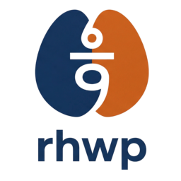

<p align="center">
  
</p>

<h1 align="center">Hwping</h1>

<p align="center">
  <strong>Downstream fork for a Chrome-packaged HWP product with a shippable `Hwping.app` wrapper</strong><br/>
  <em>Tracks upstream `rhwp` while keeping the Chrome extension, Electron wrapper, and macOS companion surfaces Hwping actually needs.</em>
</p>

<p align="center">
  <a href="README.md">한국어</a> | <strong>English</strong>
</p>

---

Hwping is a Chrome-packaged downstream fork that tracks upstream `rhwp`.

This repository has two goals.

- Keep the HWP/HWPX engine syncable with upstream
- Ship the Chrome extension as the first browser surface, ship Electron as the phase-1 `Hwping.app` wrapper, and keep macOS companion integrations small and focused

This fork still does not treat the web demo, npm distribution, or VS Code extension as first-class deliverables. The repository now includes the `rhwp-chrome/` browser-extension surface and the `apps/hwping-electron/` `Hwping.app` wrapper as active ship targets, plus the structure needed for the companion macOS product layers.

For the current direction, see [PLANS.md](PLANS.md) and [DEC-20260420-002-electron-first-desktop-rollout-with-chrome-packaging.md](records/decisions/DEC-20260420-002-electron-first-desktop-rollout-with-chrome-packaging.md).

## Current Scope

- HWP 5.0 / HWPX parsing
- Paragraph, table, equation, image, and chart rendering
- Pagination, header/footer, master page, and footnote handling
- HWP serialization plus PDF/SVG export paths
- CLI-based debugging tools and regression samples
- Chrome extension packaging and browser-reader surface work
- Electron `Hwping.app` wrapper packaging and browser-reader surface work
- Quick Look preview/thumbnail support work
- macOS file integration, Quick Look, Finder, and menu bar companion work

## Quick Start

### Requirements

- Rust 1.75+

### Build

```bash
cargo build
cargo test
cargo clippy -- -D warnings
```

### Useful CLI Commands

```bash
# Export SVG
cargo run --bin rhwp -- export-svg samples/biz_plan.hwp

# Export SVG with debug overlay
cargo run --bin rhwp -- export-svg samples/biz_plan.hwp --debug-overlay

# Inspect page layout output
cargo run --bin rhwp -- dump-pages samples/biz_plan.hwp -p 0

# Inspect one paragraph in detail
cargo run --bin rhwp -- dump samples/biz_plan.hwp -s 0 -p 45
```

## Debug Workflow

When layout or spacing diverges, inspect in this order before changing code.

1. Use `export-svg --debug-overlay` to identify the paragraph or table.
2. Use `dump-pages -p N` to inspect the page placement list and heights.
3. Use `dump -s N -p M` to inspect ParaShape, LINE_SEG, and table properties.

## Repository Layout

```text
crates/rhwp/src/
  parser/            HWP/HWPX parser
  model/             document model
  document_core/     edit commands and queries
  renderer/          layout, pagination, SVG/PDF output
  serializer/        HWP writer
  wasm_api.rs        engine binding layer

crates/hwping-core/   app-facing facade boundary
crates/hwping-ffi/    Swift-facing FFI boundary
rhwp-chrome/          browser-extension product surface
apps/hwping-electron/ Electron `Hwping.app` wrapper
apps/hwping-macos/    future native macOS shell
extensions/           Quick Look and other macOS companion targets

samples/             regression documents
mydocs/              plans, reports, and technical notes
scripts/             quality and sync helper scripts
```

The root workspace now hosts multiple crates. The upstream-aligned engine crate remains named `rhwp` and lives under `crates/rhwp` to preserve technical continuity with upstream.

## Contribution Rules

- Treat engine changes as upstreamable by default unless proven otherwise.
- Keep Hwping-only product code out of the upstream-aligned engine core.
- Do not mix browser-extension, Electron, AppKit, SwiftUI, Quick Look, or Finder integration into engine internals.
- Web, npm, and VS Code surfaces that already exist upstream are not default preservation targets in this fork.

See [CONTRIBUTING.md](CONTRIBUTING.md) for workflow details.

## Repository Operating Model

Hwping adopts `LPFchan/repo-template` as its canonical repository operating model.

- `SPEC.md`, `STATUS.md`, and `PLANS.md` are the canonical top-level truth, status, and accepted-direction surfaces.
- `INBOX.md`, `research/`, and `records/decisions/` are the canonical intake and provenance surfaces.
- git commit history via commit: LOG-* is the canonical execution-history surface.
- `upstream-intake/` remains the recurring upstream-review module for the downstream fork.
- `mydocs/` remains the deeper technical, troubleshooting, and manual layer that supports the root truth docs.
- New commits are expected to carry commit-backed provenance trailers and a `commit: LOG-*` id.

For the repository-specific rules, see [REPO.md](REPO.md), [DEC-20260409-001-repo-template-full-adoption.md](records/decisions/DEC-20260409-001-repo-template-full-adoption.md), and [DEC-20260409-002-retire-mydocs-hwping-namespace.md](records/decisions/DEC-20260409-002-retire-mydocs-hwping-namespace.md).

## Documentation

The root operating surfaces hold canonical summary truth and provenance for the repository. `mydocs/` now holds only the shared deeper detail: engine knowledge under `mydocs/tech/`, durable investigations under `mydocs/troubleshootings/`, and operational guides under `mydocs/manual/`.

## Notice

This product was developed with reference to the HWP (.hwp) file format specification published by Hancom.

## License

[MIT License](LICENSE)
